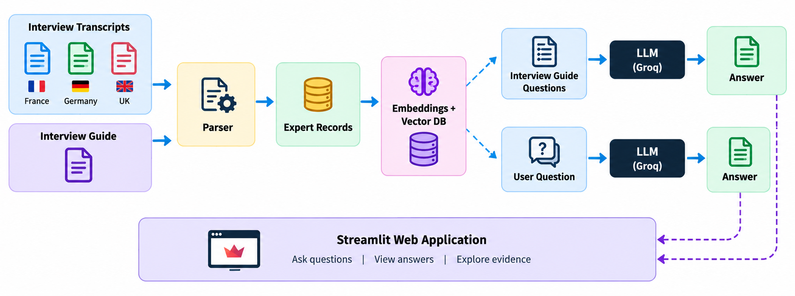
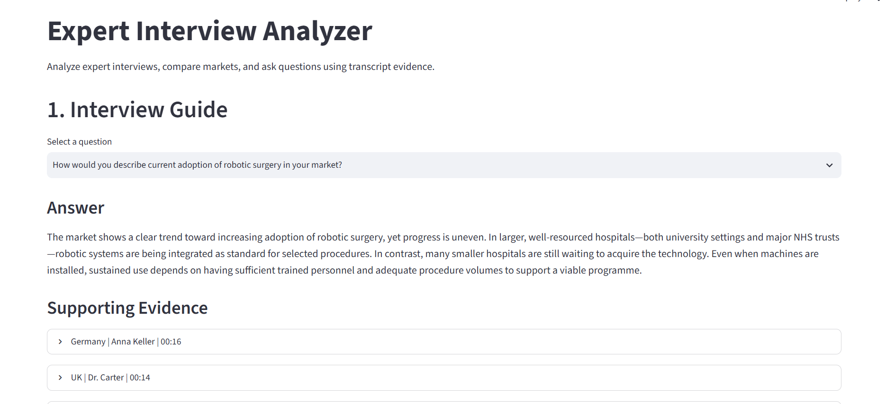

# Expert Interview Analyzer

An AI-powered application that analyzes expert interview transcripts and provides evidence-based answers to interview questions and custom queries.

## Features

- Analyze expert interviews from France, Germany, and the UK
- Answer predefined interview-guide questions
- Extract exact quotes and timestamps
- Compare insights across markets
- Ask custom questions using RAG
- Retrieve relevant transcript evidence using ChromaDB
- Generate grounded answers using Groq LLM
- Simple Streamlit interface

## Architecture



## Application



## Tech Stack

- Python
- Streamlit
- Groq LLM (`openai/gpt-oss-20b`)
- ChromaDB
- Sentence Transformers (`all-MiniLM-L6-v2`)
- Python-dotenv
- uv

## How It Works

```text
Transcripts
     ↓
Parser
     ↓
Expert Records
     ↓
Embeddings
     ↓
ChromaDB
     ↓
User Question
     ↓
Relevant Evidence
     ↓
Groq LLM
     ↓
Answer + Sources
```

## Project Structure

```text
transcript_analyzer/
│
├── app.py
├── README.md
├── pyproject.toml
├── uv.lock
├── .gitignore
│
├── images/
│   ├── architecture.png
│   └── project_screenshot.png
│
├── data/
│   ├── transcripts/
│   ├── interview_guide/
│   └── processed/
│
└── src/
    ├── parser.py
    ├── analyzer.py
    └── rag.py
```

## Setup

### 1. Install dependencies

```bash
uv sync
```

### 2. Add Groq API key

Create a `.env` file:

```text
GROQ_API_KEY=your_groq_api_key
```

### 3. Process the transcripts

```bash
uv run python -m src.analyzer
```

### 4. Run the application

```bash
uv run streamlit run app.py
```

## Conclusion

Expert Interview Analyzer turns three separate expert-call transcripts (France, Germany, UK) into a single, queryable knowledge base. By combining ChromaDB for semantic retrieval with Groq's LLM for answer generation, it grounds every response in the actual transcript evidence rather than relying on the model's own assumptions — so users can trust both the predefined interview-guide answers and any follow-up questions they ask. The result is a fast, evidence-first way to compare expert opinions across markets without manually re-reading every transcript.